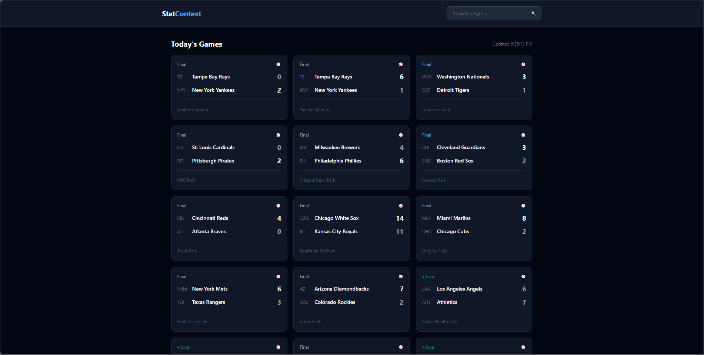
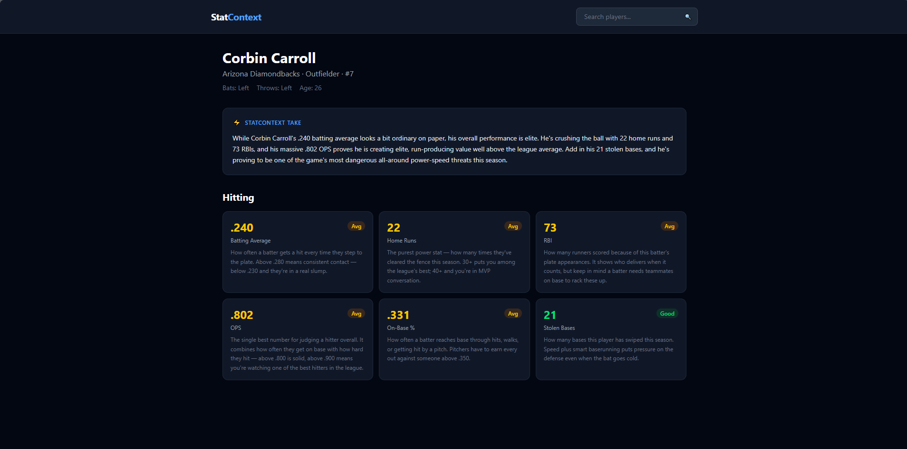

# StatContext ⚾

A sports stats app for casual fans. Every stat is explained in plain English with real context — not just numbers, but what those numbers actually mean.

**Live app:** https://stat-context.vercel.app

## Why StatContext?

ESPN and CBS Sports are built for die-hards who already know what every stat means. StatContext shows the same stats but explains them in plain English and tells you how a player stacks up against the rest of the league — so a casual fan actually understands what they're looking at.

For example, instead of just showing a pitcher's ERA, StatContext explains what ERA means and adds context like how it compares to the MLB average.

## Features

- **Live game feed** — today's MLB games with live, final, and upcoming statuses, auto-refreshing so scores stay current
- **Player search** — find any MLB player and jump straight to their profile
- **Player profiles** — season stats with color-coded performance ratings and plain-English explanations of what each stat means
- **StatContext Take** — an AI-generated summary that reads a player's season and explains, in plain English, what stands out and how they compare to the league
- **StatSpotlight** *(in progress)* — a daily featured stat story surfacing the most interesting performances

## Tech Stack

- **Frontend:** React + Vite, React Router
- **Styling:** Tailwind CSS
- **Data:** MLB Stats API (free, no key required)
- **AI:** Google's Gemini API for contextual player summaries
- **Backend:** Vercel serverless functions
- **Deployment:** Vercel

## Architecture Notes

A few deliberate design decisions behind the app:

- **Serverless API proxy** — all third-party API calls (MLB and Gemini) run through Vercel serverless functions rather than the browser. This solves CORS restrictions and keeps the Gemini API key server-side, never exposed to the client.
- **Adapter pattern for stats data** — raw MLB API responses are normalized into a consistent internal shape, so UI components stay decoupled from the API's structure and the app is positioned to support additional sports without rewriting the frontend.
- **Graceful degradation** — the AI summary is a non-blocking enhancement. If the Gemini call is slow, fails, or is rate-limited, the player profile still renders fully; the summary card simply doesn't appear.
- **Rate limiting** — the AI endpoint is rate-limited per IP as a cost safeguard, since each call has a real API cost.

## Running locally